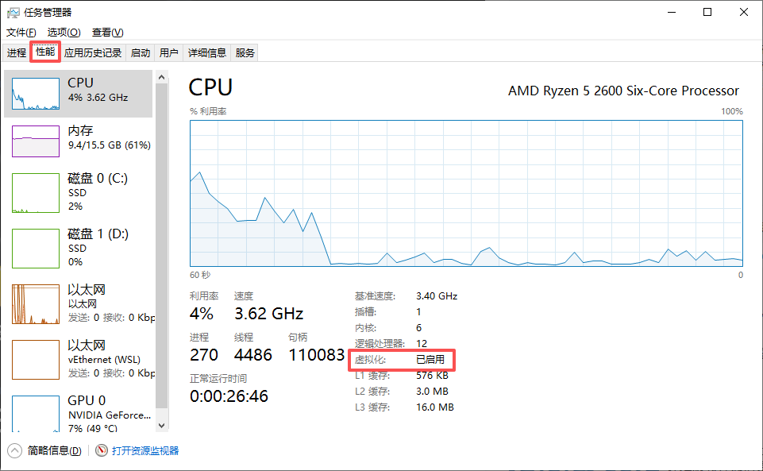
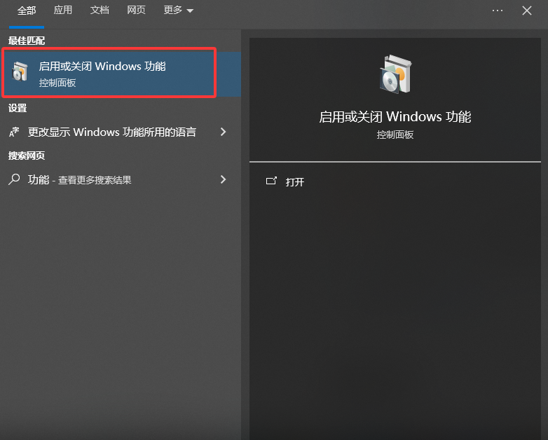
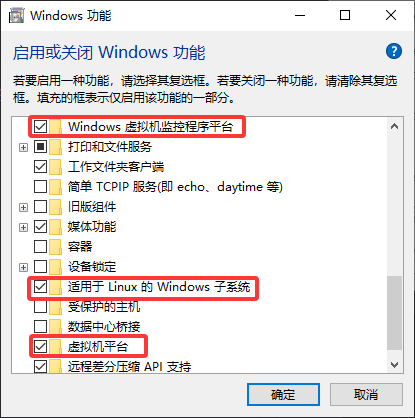

- [第一步：打开cpu虚拟化](#第一步打开cpu虚拟化)
  - [cpu虚拟化](#cpu虚拟化)
- [第二步：windows功能开启](#第二步windows功能开启)
- [第三步：安装wsl](#第三步安装wsl)
- [第四步：安装docker desktop](#第四步安装docker-desktop)
- [常用命令](#常用命令)
  - [docker pull](#docker-pull)
  - [docker images](#docker-images)
  - [docker rmi+id/name](#docker-rmiidname)
  - [docker run + 镜像](#docker-run--镜像)
  - [docker ps](#docker-ps)
  - [docker stop+id/name](#docker-stopidname)
  - [docker rm+id/name](#docker-rmidname)

# 第一步：打开cpu虚拟化

## cpu虚拟化



<video src="./video/cpu虚拟化设置.mp4" controls width="800" height="300"></video>


# 第二步：windows功能开启



# 第三步：安装wsl

cmd执行两个命令
```cmd
<!-- 把wsl版本默认设置为2 -->
wsl --set-default-version2
wsl --update
```

# 第四步：安装docker desktop 

去官网下载安装
安装时指定路径：、
1、以管理员身份打开Windows终端（CMD或PowerShell），cd 到安装包所在目录。

2、执行以下命令（注意提前手动创建好目标文件夹，否则会报错）
```cmd
start /w "" "Docker Desktop Installer.exe" install --installation-dir="C:\Docker" --wsl-default-data-root="C:\Docker\data"
```

# 常用命令

## docker pull

```docker
docker pull docker.io/library/nginx:latest
docker pull 仓库地址/命名空间/镜像:版本号
```

## docker images

列出所有下载的镜像

## docker rmi+id/name

删除镜像

## docker run + 镜像

```docker
容器后台执行 -d
docker run -d
宿主机和容器绑定 -p
docker run -p 80:80
挂载卷：宿主机和容器目录绑定-v
docker run -d -p 80:80 -v C:\docker\website\html:/usr/share/nginx/html nginx
```

运行镜像创建容器

## docker ps

查看正在运行的容器

## docker stop+id/name

停止容器

## docker rm+id/name

删除容器
